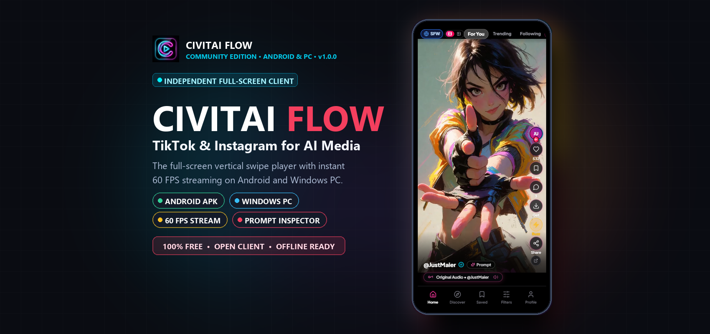

# ⚡ Civitai Flow

> **The TikTok & Instagram Client for Civitai (Videos & Images)**

<p align="center">
  
</p>

<p align="center">
  <a href="https://civitaiflow.web.app"></a>
  <a href="https://civitaiflow.web.app"></a>
  <a href="https://civitaiflow.web.app"></a>
  <a href="https://github.com/WalidAliAlfaid/civitai-flow/releases"></a>
  <a href="LICENSE"></a>
</p>

---

Love Civitai, but watching videos on the web is kind of painful.

You spend more time clicking in and out of pages than actually enjoying the art. It’s hard to relax and get immersed when you're trapped in a desktop browser.

I wanted something smooth, clean, and instant where you just swipe from one full-screen video to the next.

So I made **Civitai Flow** (Android & Windows): **TikTok & Instagram meets Civitai, exclusively for Civitai.**

Instead of browsing creative generations in desktop thumbnail grids, Civitai Flow delivers a dedicated, distraction-free visual feed on your **Android phone** and **Windows PC**.

---

## 📸 Experience Preview

<p align="center">
  
</p>

---

## ✨ What Civitai Flow Delivers

* 📱 **Fullscreen Video & Image Stream:** Built from the ground up to view AI videos and high-resolution images in fluid 60fps fullscreen. Seamlessly swipe vertically with instant playback, crystal-clear detail, and zero browser lag.
* ✨ **Feeds for Every Mood:**
  * **For You Feed:** Personalized discovery tailored to the styles, visuals, and animations you enjoy most.
  * **Trending Feed:** Catch the hottest videos and images blowing up across the Civitai community right now.
  * **Following Feed:** An uninterrupted stream dedicated strictly to the creators and artists you follow.
* 🔖 **Saves & Civitai Collection Sync:** 1-tap bookmark any video or image into your personal library, and seamlessly sync your saves with your existing Civitai collections. You can also bring in your Civitai collections directly to help the app understand your taste, keeping your favorites organized and available offline.
* 🧠 **Smart "For You" Recommendation Algorithm:** Civitai Flow doesn't just shuffle random posts—it learns what you love. The algorithm analyzes your watch time, likes, prompt inspections, and imported Civitai collections in real time. The more you swipe, the better it gets at serving the exact art styles, aesthetics, and video genres tailored specifically to you.
* ❤️ **Native Community Interaction & Earn Buzz:** Like, react, open comment threads, follow creators, and tip Buzz straight from the post. Because it connects directly with your Civitai account, your engagement counts just like on the official website, meaning you can earn your Buzz simply by reacting and interacting with posts in the app!
* 🔍 **1-Tap Prompt Inspector:** Tap `Prompt` on any post to inspect the exact model checkpoint, LoRAs, positive/negative prompts, CFG scale, and sampler. Includes a 1-click **Copy Prompt** button to take recipes directly to your own workflows.
* 🔞 **SFW vs. Civitai Red Switcher:** Instant 1-tap header toggle between clean artistic showcases and unrestricted mature content.
* ⬇️ **Direct MP4 & Image Downloads:** Save raw high-res videos and original images directly to your device with one click.

> *(Note: Currently focused 100% on discovery and consumption. If you want built-in generation tools added, leave a comment or issue and I will build generation workflows into future updates!)*

---

## 📥 Try It & Downloads

| Platform | Download Link | Type | Notes |
| :--- | :--- | :--- | :--- |
| 📱 **Android** | [Download CivitaiFlow.apk](https://civitaiflow.web.app/downloads/CivitaiFlow.apk) | Direct APK | Android 8.0+ |
| 💻 **Windows Desktop** | [Download Civitai Portable.exe](https://civitaiflow.web.app/downloads/Civitai-Portable.exe) | Standalone Portable | No installation required, just double-click |
| 🌐 **Website Portal** | [civitaiflow.web.app](https://civitaiflow.web.app) | Web Portal | Live download hub & info |
| 🎬 **Quick 1:40 Video Demo** | [Watch Walkthrough](https://civitaiflow.web.app/#demo) | Video Walkthrough | Watch how it works right in your browser! |

---

## 💡 Community Feature Requests & Support

I built this for the community out of pure passion for generative art.

* 👉 **Want new features or filters?** [Open an Issue / Feature Request](https://github.com/WalidAliAlfaid/civitai-flow/issues) or leave a comment on the Civitai article, and I will build them!
* 🟣 **Support the Project:** If you enjoy the app, you can support ongoing hosting and development via the crypto tip jar:

### **USDT (Tether) — BNB Smart Chain (BEP-20)**
* **Network:** `BNB Smart Chain (BEP-20)`
* **Wallet Address:**
  ```text
  0x8f90dCf4bE34e95c87527612b7da440ef99d8EB5
  ```

<p align="left">
  
</p>

> ⚠️ *Please ensure you select **BNB Smart Chain (BEP-20)** when sending USDT.*

---

## 💌 Open Note to the Civitai Team

I built this out of pure love and passion for Civitai.

If you like this concept, **it is completely yours**: You are welcome to adopt it, brand it officially, add your own ads, or integrate it into Civitai however you see fit.

If you want someone to manage it, push updates, fix issues, and build whatever new features you need, **I will happily do all the work for free**.

If you feel this conflicts with your roadmap or you don't want it online, just say the word and I will take it down immediately with no questions asked.

---

## ⚖️ Disclaimer

Civitai Flow is an independent community project developed out of passion for generative AI video and imagery. Civitai and its respective logos, branding, and services are property of Civitai Inc.

---

<p align="center">
  <b>Built with ❤️ for the Civitai Creator Community</b>
</p>
