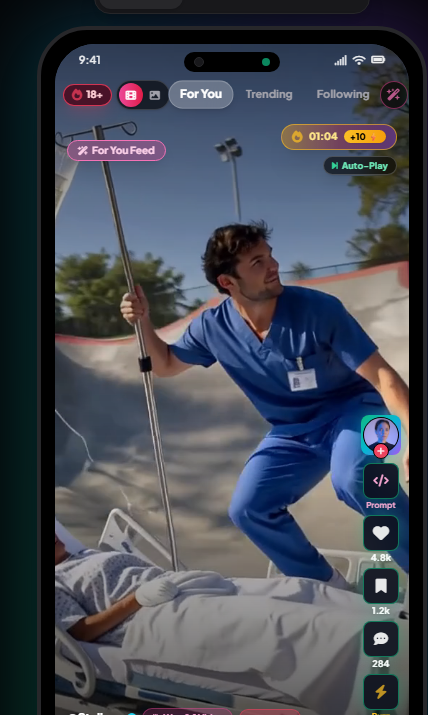

# ⚡ Civitai Flow

> **The TikTok & Instagram Client for Civitai (Videos & Images)**

**Civitai Flow** brings a modern, fast, full-screen vertical swipe experience to [Civitai](https://civitai.com). Think of it as **TikTok meets Instagram, built specifically for Civitai videos and images.**

Instead of browsing creative generations in desktop thumbnail grids, Civitai Flow delivers a dedicated, distraction-free visual feed on your **Android phone** and **Windows PC**.

---

## 📸 Experience Preview

  

---

## ✨ What Civitai Flow Offers

* **📱 Infinite Fullscreen Swipe:** Seamlessly swipe through top AI video creations and high-resolution images with zero lag and native 60fps streaming.
* **🔑 Seamless Civitai Account Sign-In (No API Keys Needed):** Log into your standard Civitai account directly via secure web sign-in. Your account, profile, and community standing sync straight into the app.
* **🔍 1-Tap Prompt & Model Inspector:** Tap `Prompt` on any post to inspect the exact model checkpoint, LoRAs, positive/negative prompts, CFG scale, and sampler. Includes a 1-click **Copy Prompt** button to take recipes directly to your own workflows.
* **❤️ Complete Social Interaction:** Like, react, open comments, follow your favorite creators, save/bookmark to personal collections, and tip Buzz natively.
* **🔞 1-Tap SFW & Civitai Red Switcher:** Instant header toggle between clean artistic showcases and unrestricted mature content.
* **💾 Direct Downloads & Offline Caching:** Download high-res MP4s and original images directly to your device, or cache watched clips for offline viewing.
* **🎨 Left & Right Hand Ergonomics:** Switch button placements for comfortable one-handed scrolling.
* **🚀 Generation Coming on Demand:** Built for instant consumption and community discovery. If creators request built-in generation tools, we will expand to support generation workflows!

---

## 📥 Downloads & Installation

| Platform | Download Link | Type | Notes |
| :--- | :--- | :--- | :--- |
| **Android** | [Download CivitaiFlow.apk](https://civitaiflow.web.app/downloads/CivitaiFlow.apk) | Direct APK | Android 8.0+ |
| **Windows Desktop** | [Download Civitai Portable.exe](https://civitaiflow.web.app/downloads/Civitai-Portable.exe) | Standalone Portable | No install required, just double-click |
| **Windows Installer** | [Civitai Flow Setup](https://civitaiflow.web.app) | NSIS Installer | Full desktop installation |
| **Live Web & Demo** | [civitaiflow.web.app](https://civitaiflow.web.app) | Web Portal | Watch the 1:40 video demo |

---

## 💡 Community Feature Requests & Bug Reports

Civitai Flow was built for the creator community:
* Have an idea or want a feature added?
* Found a bug or playback glitch?

👉 **[Submit a Feature Request or Report a Bug](https://github.com/WalidAliAlfaid/civitai-flow/issues)**

---

## ⚖️ Disclaimer

Civitai Flow is an independent community project developed out of passion for generative AI video and imagery. Civitai and its respective logos, branding, and services are property of Civitai Inc.

---

  <b>Built with ❤️ for the Civitai Creator Community</b>

