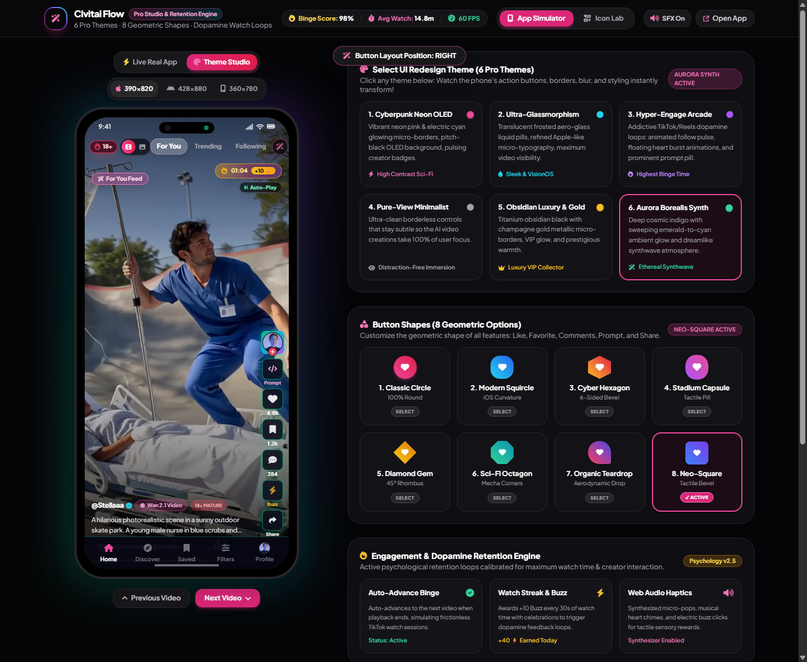

# ⚡ Civitai Flow

> **The TikTok-Style Infinite AI Video Feed for Android & Windows Desktop**

Civitai Flow is a dedicated, full-screen vertical swipe video client built specifically for AI video generations from [Civitai](https://civitai.com) (Wan 2.1, Kling, LTX Video, Hunyuan, Minimax).

Rather than browsing short-form videos in traditional desktop thumbnail grids, **Civitai Flow** delivers a native, 60fps vertical swipe experience tailored for mobile phones and desktop displays.

---

## 📸 Screenshots & Experience

  

---

## ✨ Key Features

* **📱 Infinite 60fps Vertical Swipe:** Ultra-smooth continuous media streaming with zero lag, instant loop playback, and watchdog auto-recovery.
* **🔍 1-Tap Prompt & Model Inspector:** Tap `Prompt` on any video to instantly reveal the exact checkpoint model, LoRA tags, positive/negative prompts, CFG scale, and sampler. Includes 1-click prompt copying.
* **❤️ Full Social Integration:** Like, reaction picker, comment drawer, creator bookmarking, and native **Buzz tipping** straight from the video.
* **🔞 SFW vs. Civitai Red (18+) Switcher:** 1-tap header toggle between safe artistic showcases and unrestricted mature content.
* **🎨 Ergonomic Studio:** Customize your controls for one-handed use: move buttons to the **Left** (for left-handed users), **Right**, **Split**, or **Bottom**, and choose custom button shapes (squircles, diamonds, neon pills).
* **💾 Direct Downloads & Offline Caching:** Download uncompressed MP4s straight to your device downloads, or save watched clips locally for offline viewing.

---

## 📥 Downloads & Installation

| Platform | Download Link | Type | Notes |
| :--- | :--- | :--- | :--- |
| **Android** | [Download CivitaiFlow.apk](https://civitaiflow.web.app/downloads/CivitaiFlow.apk) | Direct APK | Android 8.0+ |
| **Windows Desktop** | [Download Civitai Portable.exe](https://civitaiflow.web.app/downloads/Civitai-Portable.exe) | Standalone Portable | No install required, just run |
| **Windows Installer** | [Civitai Flow Setup](https://civitaiflow.web.app) | NSIS Installer | Desktop shortcuts & updater |
| **Web & Demo Reel** | [civitaiflow.web.app](https://civitaiflow.web.app) | Live Web | 1:40 walkthrough demo |

---

## 🔒 Privacy & Security

* **Zero Tracking:** Civitai Flow does not sell, track, or harvest user telemetry.
* **Local API Keys:** If you enter your Civitai API Key to sync likes or tip Buzz, it is stored **exclusively in your local device's sandboxed storage** and is sent only to Civitai's official API endpoints.
* **Anonymous Browsing:** You can watch infinite video streams completely anonymously without ever signing in or providing an account.

---

## 💡 Feature Requests & Bug Reports

We love hearing from the community! 
* Want a new filter, custom model categories, or a specific feature?
* Found a bug or playback issue?

👉 **[Submit a Feature Request or Issue](https://github.com)**

---

## ⚖️ Disclaimer

Civitai Flow is an independent community project developed out of passion for generative AI video. Civitai and its respective logos, branding, and API services are trademarks and property of Civitai Inc. This project is not officially affiliated with or endorsed by Civitai Inc.

---

  <b>Built with ❤️ for the Civitai Creator Community</b>

